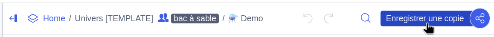
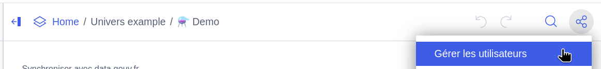
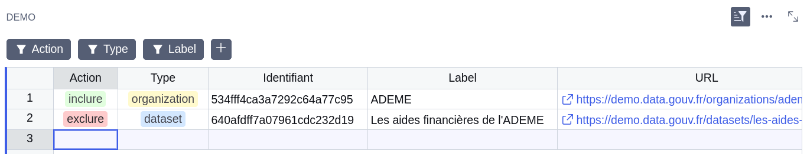
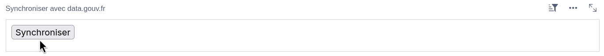

# ecospheres-universe

Outils permettant de gérer l'univers d'une [verticale data.gouv.fr](https://github.com/opendatateam/udata-front-kit).


## Architecture

TODO: schema

Composé de :
1. définition Grist
2. script de mise à jour
3. github action


## Mise en place d'un univers

### Configuration Grist

La gestion d'un univers se fait par l'intérmédiaire d'un document Grist, dans lequel sont listés les éléments devant être inclus ou exclus dans la verticale cible, ceci pour chaque environnement data.gouv.fr actif.

> [!WARNING]
> Ne pas modifier les noms des tables et des champs du document Grist.

Pour définir un univers Grist :

1. Sauvegarder une copie du [modèle Grist](https://grist.numerique.gouv.fr/o/ecospheres/gEY4qJF25TEX/Univers-TEMPLATE) depuis un compte qui servira à administrer l'univers :

   

2. Donner l'accès au document créé, en "lecture seule", au compte de service par défaut `4edf618b-6d1e-4914-b4e7-d6ec14e10289@serviceaccounts.invalid` (ou créer un [compte de service dédié](https://forum.grist.libre.sh/t/comptes-de-services-une-cle-api-limitee-a-certains-documents-dossiers-organisations/2198/1)) :

   

3. Lister les entités composant l'univers dans la table correspondant à l'environnement data.gouv.fr ciblé :

   

   Pour chaque entité, les trois champs requis sont : `Action`, `Type` et `Identifiant`.

   Les champs optionnels `Label` et `URL` peuvent être automatiquement synchronisés depuis data.gouv.fr en cliquant sur le bouton "Synchroniser" en haut du document :

   

   Il est également possible d'ajouter des champs personnalisés selon les besoins. Ces champs seront ignorés par les outils présents dans ce dépôt.


### Configuration du script

La configuration du script de mise à jour est définie dans un fichier `configs/{site}-{env}.yaml`, correspondant à la verticale `site` de l'environnement data.gouv.fr `env`.

> [!WARNING]
> Ne pas mettre les clés d'API dans les fichiers versionnés sur GitHub!

Pour configurer le script pour un univers :

1. Créer un fichier de configuration `configs/{site}-{env}.yaml` sur le modèle suivant :

   ```yaml
   topic: {mon-topic-univers}
   tag: {mon-tag-univers}
   datagouv:
     url: https://www.data.gouv.fr  # ou https://demo.data.gouv.fr
     token: CONFIGURE_ME
   grist:
     url: https://grist.numerique.gouv.fr/o/{mon-compte-grist}/api/docs/{identifiant-du-document}
     table: Prod  # ou Demo
     token: CONFIGURE_ME
   output_dir: dist/{mon-univers}-prod  # ou dist/{mon-univers}-demo
   ```

2. Configurez les clés d'API Grist et data.gouv.fr dans GitHub et/ou en local selon le mode d'exécution (voir ci-dessous).


### Configuration de l'exécution automatique

L'exécution périodique du script de mise à jour est gérée par le workflow GitHub Actions [`update-universes`](https://github.com/ecolabdata/ecospheres-universe/blob/main/.github/workflows/update-universes.yml), qui met quotidiennement à jour les univers configurés.

Pour ajouter une configuration d'univers au workflow :

1. [Créer un environnement GitHub](https://github.com/ecolabdata/ecospheres-universe/settings/environments) en suivant la convention `{site}-{env}`.

2. Configurer le secret `DATAGOUV_API_KEY` pour le nouvel environnement. Si Grist n'utilise pas le compte de service par défaut, configurer également le secret `GRIST_API_KEY`.

3. Ajouter le nouvel environnement `{site}-{env}` à `jobs.run-update.strategy.matrix.universe` dans le [workflow](https://github.com/ecolabdata/ecospheres-universe/blob/main/.github/workflows/update-universes.yml).


## Utilisation en local

Le script peut également être utilisé en local pour des tests ou une exécution ponctuelle.


### Installation des dépendances

```shell
uv sync
```


### Configuration

> [!NOTE]
> La clé d'API du compte de service Grist par défaut est disponible auprès des administrateurs de ce dépôt.

Les fichiers de configuration versionnés ne devant pas contenir les clés d'API, il est nécessaire de les configurer localement. Soit :

- Configurer les variables d'environnement `DATAGOUV_API_KEY` et `GRIST_API_KEY`.

- Utiliser un fichier de configuration supplémentaire *non-versionné*, à passer en supplément lors de l'appel du script :

  ```yaml
  datagouv:
    token: {mon-token-datagouv}
  grist:
    token: {mon-token-grist}
  ```


### Utilisation du script

#### Créer ou mettre à jour un univers

Crée ou met à jour un univers à partir de sa définition Grist.

```shell
uv run ecospheres-universe feed-universe [options] configs/{site}-{env}.yaml [config-overrides.yaml ...]
```

Options :
- `--dry-run` : Exécute le script en mode essai, sans appliquer les modifications au topic.
- `--fail-on-errors` : Interrompt l'exécution en cas d'erreur.
- `--reset` : Efface le contenu du topic avant de le re-synchroniser.
- `--verbose` : Affichage détaillé lors de l'éxécution.

En plus de la mise à jour de l'univers sur data.gouv.fr, le script génère plusieurs fichiers `dist/{site}-{env}/organizations-{type}.json` contenant les organisations data.gouv.fr qui référencent des objets appartenant à l'univers mis à jour. Ces fichiers peuvent être [utilisés comme API par `udata-front-kit`](https://github.com/opendatateam/udata-front-kit/blob/main/configs/ecospheres/config.yaml).


#### Vérifier la synchronisation

Vérifie la synchronisation des organisations de l'univers entre l'index Elasticsearch et la base de données MongoDB de data.gouv.fr.

```shell
uv run ecospheres-universe check-sync configs/{site}-{env}.yaml [config-overrides.yaml ...]
```
